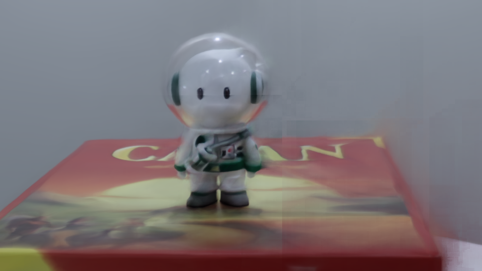

# Spiking-NeuLF: A Low-Power Spiking Neural Light Field Model for Efficient View Synthesis
Seonghan Kwon<sup>1</sup>, Hakyeong Lee<sup>1</sup>,   
<sup>1</sup>Seoul National University of Science and Technology

<p align="center">
  
</p>

> With the rise of the metaverse, the use of edge devices such as VR/AR devices is expanding. 
In the case of [NeRF](https://arxiv.org/pdf/2003.08934) , which was previously studied, precise viewpoint synthesis is possible, but there is a disadvantage of many sampling and slowness based on volumetric rendering. In addition, since GPU usage and computation are large, there is a limitation that real-time processing in edge devices is difficult. On the other hand, [NeuLF](https://arxiv.org/pdf/2105.07112) has the advantage of low computation and fast inference because it predicts RGB values directly with Ray-plane intersection method and one MLP. These structural advantages can serve as a more suitable rendering solution in edge device environments where real-time is important. Nevertheless, NeuLF is advantageous in terms of speed, but still has limitations of ANN structure in terms of computational amount and power consumption. In this work, to address this issue, we propose a [Spiking-NeuLF](https://github.com/2322wednesday/Spiking-NeuLF) model and its possibilities that simultaneously achieve computational efficiency and energy savings by combining SNNs with low-power characteristics into NeuLF.

# Installation
```
git clone https://github.com/2322wednesday/Spiking-NeuLF.git .
conda env create -n spikingNeuLF --file environment.yml
```

# How to Run
### Quick Demo our SpikingNeuLF
It takes about 1 hour 20 minutes based on RTX 3090. (Because of snntorch)
```
python src/llffProcess.py --data_dir dataset/Ollie --factor 4
python src/demo_snn_rgb.py --exp_name Ollie_d8_w256_0to1 --data_dir dataset/Ollie/ --time_steps 22000
```
<p align="center">
  
</p>


### Quick Train and Run our SpikingNeuLF
If you want to proceed with both Training and Inference with our code, use the code below.
```
python src/llffProcess.py --data_dir dataset/Ollie --factor 4
python src/train_spikingneulf.py --data_dir dataset/Ollie --exp_name Ollie_d8_w256

# Split NeuLF weights into SNN, ANN model's weights
python src/extract_weights.py 
python src/demo_snn_rgb.py --exp_name Ollie_d8_w256_0to1 --data_dir dataset/Ollie/ --time_steps 22000
```


### Quick Demo NeuLF(DNN)
```
python src/llffProcess.py --data_dir dataset/Ollie --factor 4
python src/demo_rgb.py --exp_name Ollie_d8_w256 --data_dir dataset/Ollie/
```
After running the above script, you can get both gif and mp4 at ./demo_result_rgb/Exp_Ollie_d8_w256/, similar to this:
<p align="center">
  
</p>