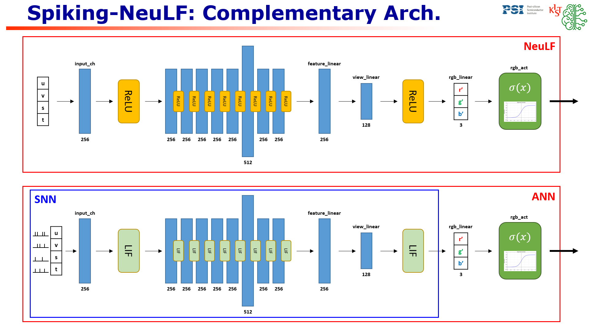

# Spiking-NeuLF: A Low-Power Spiking Neural Light Field Model for Efficient View Synthesis
Seonghan Kwon<sup>1</sup>
<sup>1</sup>Seoul National University of Science and Technology

<p align="center">
  
</p>

[NeuLF](https://oppo-us-research.github.io/NeuLF-website/) (Neural 4D Light Field) is a method that achieves state-of-the-art results for synthesizing novel views of complex scenes. 

# Installation
```
git clone https://github.com/2322wednesday/Spiking-NeuLF.git .
git clone https://github.com/oppo-us-research/NeuLF.git
cd NeuLF
conda env create -n nelf --file environment.yml
```