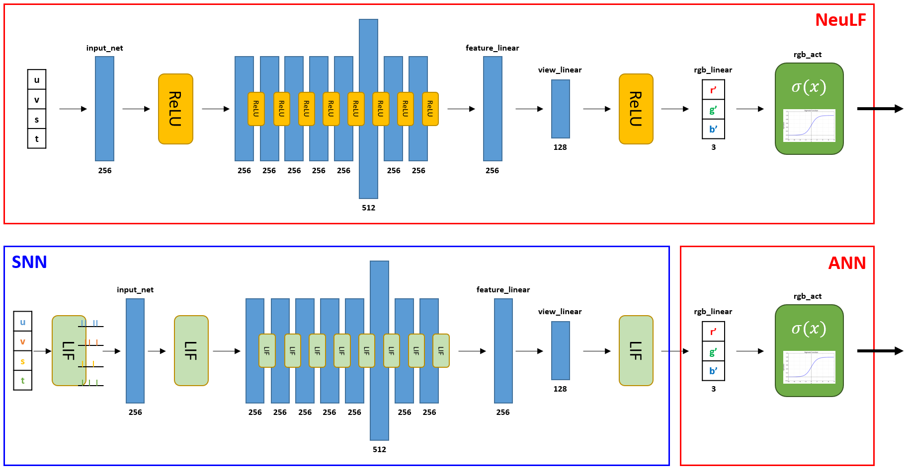

# Spiking-NeuLF: A Low-Power Spiking Neural Light Field Model for Efficient View Synthesis
Seonghan Kwon<sup>1,2</sup>   
<sup>1</sup>Seoul National University of Science and Technology, <sup>2</sup>Korea Institute of Science and Technology

<p align="center">
  
</p>

> [NeuLF](https://oppo-us-research.github.io/NeuLF-website/) (Neural 4D Light Field) is a method that achieves state-of-the-art results for synthesizing novel views of complex scenes. 

# Installation
```
git clone https://github.com/2322wednesday/Spiking-NeuLF.git .
conda env create -n spikingNeuLF --file environment.yml
```

# How to Run
### Quick Demo our SpikingNeuLF(SNN+DNN)
```
python src/demo_snn_rgb.py --exp_name Ollie_d8_w256_0to1 --data_dir dataset/Ollie/ --time_steps 21100

```
```
python src/llffProcess.py --data_dir dataset/Ollie --factor 4
python src/extract_weights.py 
python src/demo_snn_rgb.py --exp_name Ollie_d8_w256_0to1 --data_dir dataset/Ollie/ --time_steps 21100

```
### Quick Demo NeuLF(DNN)
```
python src/llffProcess.py --data_dir dataset/Ollie --factor 4
python src/demo_rgb.py --exp_name Ollie_d8_w256 --data_dir dataset/Ollie/
```
After running the above script, you can get both gif and mp4 at ./demo_result_rgb/Exp_Ollie_d8_w256/, similar to this:
<p align="center">
  
</p>